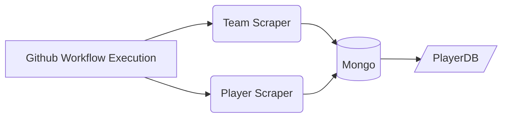

# football-prediction

## Breakdown

- Landing page with login for players + admin
- Backend login service
- Logged in home page
- Home page of league current season + last week scores
- Gameweek prediction
- Prem/FA/CL

- Service to pull players across leagues and respective clubs
- Service to pull results and scorers
- Service to carry out calculations and update db with scores
- Service to manually overwrite scores

## Player and Team Scraper Services

